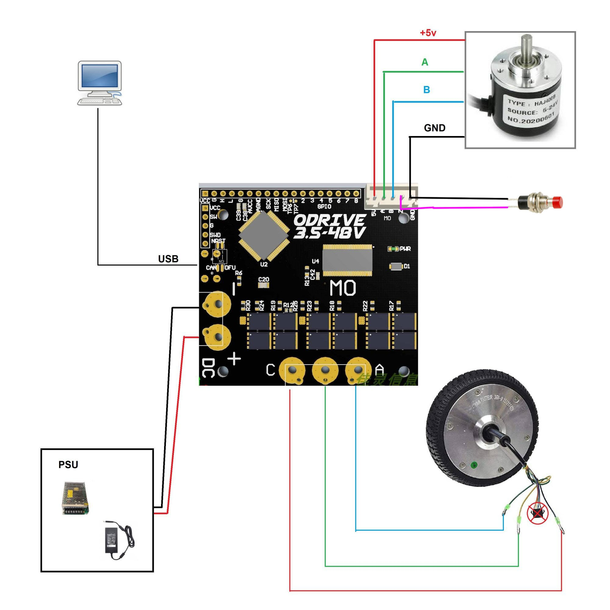
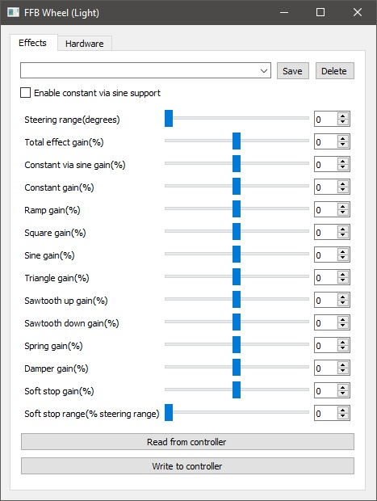
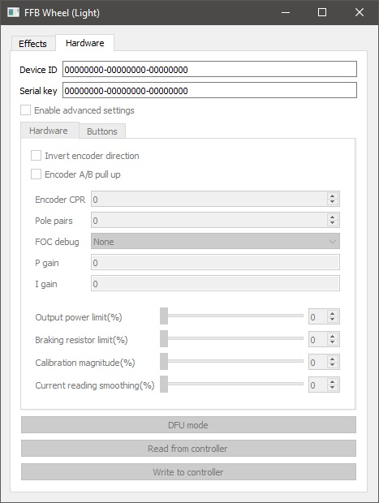

# BLDC-FFB-WHEEL

Discord: 
https://discord.gg/saSWtmbp

Forum link:
https://forum.simracing.su/topic/4400-dd-rul-iz-hoverborda-ya-sdelal-eto/

## Required Parts/Materials

* Odrive Board (Tested on two axis ODrive, one axis ODrive and ODESC3.6 clone)
* Hoverboard Motor
* Incremental Encoder (Suppports both OMRON style encoders and AMT 102/103 series)

* STLINK (for ODrive versions that do not have DFU switch onboard, f.e. ODESC3.6)

## Assembly

Connection diagram (Note the button. It is optional, but helpfull. It's functionality to reset center position of the wheel. In normal operation position in which wheel was connected to power sourse considered as the center, but if you need to reset it - just press the button)

Some notes about braking resistor. The idea is to choose resistor and then adjust Braking resistor limit on hardware tab. I sucesfully used 2R and 10R resistors.
First you connect resistor and start with 1% of Braking resistor limit. Then start increasing it by 1 tick and experiment - you need to stop at the point when PSU stops to go into overvoltage protection mode.
For example for my PSU (15v 13A) it works with value 5% for 2R resistor and 10% for 10R resistor

## Mechanical part

More details on mechanical [here](/hardware/)

## Firmware

To program board you need [STM32CubeProgrammer](https://www.st.com/en/development-tools/stm32cubeprog.html)
* Change Odrive to DFU mode
* Connect power and USB
* In CubeProgrammer choose USB option and select USB port and connect
* Open hex file and Download it in controller
* After complete operation disconnect device by pressing disconnect button
* Disconnect power supply and change Odrive to standard mode
* Connect power supply

## Calibration and Configration

### Calibration

Before connecting the power supply set correct center position of steering wheel. Wheel will calibrate automatically when power is on.

### GUI 

**Effects**

* Dropdown with saved profiles. To add new profile just type name of profile and clic save. 

* Enable constant via sine - Enables support for effects similar to Raceroom (it sends effects in different form from other games). So far I've only met in one game. For everything except the Raceroom keep it unchecked.
* Steering range - I think without question.
* Everything with the addition of word 'gain' is the adjustment of the strength of individual effects. Everything that is plus turns in one direction, everything that is minus turns in the other. Damper is not implemented at the moment, Total is the total effort scale that is applied to everything at once. If you need to invert all effects, just invert Total.
* Soft stop range - the distance in percentage from the 'steering range' at which the stop force increases at the end of the range. At the same time, the output values ​​​​of the joystick axis are already at the maximum in this range

**Hardware**

* Invert encoder direction - changes the encoder output direction. Does the same thing as changing the connection of pins A and B to the controller. I prefer to keep that setting the way so when turning the steering wheel clockwise, the values of axis increases.
* A / B pullup - set for encoders that need to pull up the outputs to the power supply. Most encoders of 'Omron style' requires it, but see the instructions for the encoder if you need it or not.
* Encoder CPR - total encoder CPR, including reduction ration (if any) CPR = PPR * 4 * reduction ratio
* Pole pairs - the number of pairs of motor magnets. A hoverboard motor has 15 in most cases.
* P Gain / I Gain - FOC algorithm parameters. Setting them up is a separate issue, I need to write a separate post with pictures.
* Constant reading smoothing. Important parameters depend on them "noisiness" and the accuracy of the algorithm, but not easy to set up. Will be separately for them.
* Output power - total power as a percentage of the physically possible. Start low and increase a little at a time until the motor stays stable and doesn't overheat.
* Braking resistor limit - power that can be dissipated by praking resistor as a percentage of the physically possible. Start low and increase a little at a time until the PSU stop to go into overvoltage protection during quick wheel rotation.

**Buttons tab**

As firmware supports connection of Thrustmaster wheels, and different whells have some buttons constantly pressed you can check which button state to ignore.

**General buttons mapping**
* read what is written in the controller 
* write to the controller.

Each tab has its own buttons. Changes to the effects tab are saved separately to the hardware tab.

### Full version

The Hardware tab is inactive until the Serial Key for a specific Device ID is entered.
When the correct key is entered and the Register button is pressed, the program switches to full mode and the Enable advanced settings button becomes available on the Hardware tab. (known bug - the key is not saved between controller restarts - I'm working on it)
The Enable advanced settings button has been added so as not to accidentally change what is not necessary. For good, everything on this tab should be configured only once and forgotten.

Full version of firmware is available by request [contact me](mailto:olukelo.company@gmail.com)

## Tested games

* Assetto Corsa
* Assetto Corsa Competizione
* Project Cars
* Automobilista 2
* rFactor 2
* Raceroom Racing Experience
* Dirt Rally 2.0 - For the steering wheel to work, follow the instructions in the [documents](/docs/codemasters_games.md)
* iRacing
