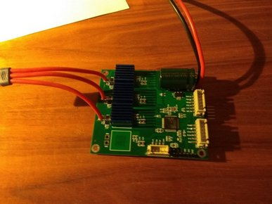

 

BLDC controller based on BTN8982. It hasthree briges for motor controll and one(optional) for braking resistor. It has mostly one side component placement for cheep order at JLCPCB. You only need to solder BTN8982, AD8417 and a couple condensators at your own.

Board project is located at https://easyeda.com/olukelo/btn8982-three-phase-controller_copy_copy
